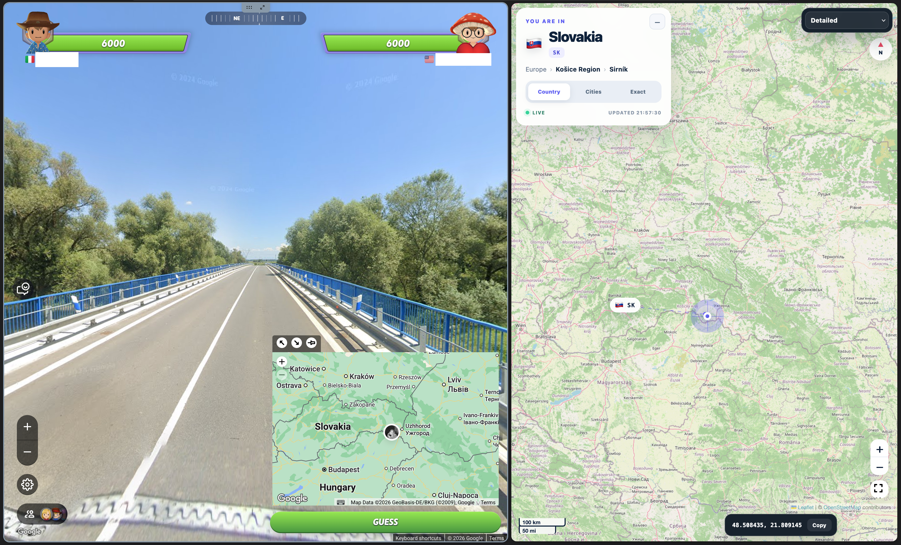

# GeoGuessr External Cheat

A Python script that creates a separate live map for GeoGuessr, displaying location coordinates extracted from Google Maps metadata through local proxying with **mitmproxy**. The script automatically installs missing third-party libraries, including mitmproxy, Folium, and their dependencies, through pip.

The script runs externally, without injecting code into the game or requiring a browser extension. **External does not mean undetectable:** detection, continued compatibility, and account safety are not guaranteed.

## Showcase



## Features

- Separate browser map with country, city, and exact-location views.
- Country, region, locality, and coordinate display with a copy action.
- Six map styles, including satellite and night views.
- Automatic installation of missing Python dependencies.
- Automatic system-proxy configuration on macOS and Windows, with restoration on normal exit.
- A local map server at `http://127.0.0.1:8765/` and a local proxy at `127.0.0.1:8080` by default.

## Run

Install Python with pip, using a Python version supported by the current mitmproxy release. Then download the source or clone this repository:

```sh
git clone https://github.com/cesare-nq/geoguessr-external-cheat.git
cd geoguessr-external-cheat
python3 maps_interceptor.py
```

On Windows, use `py maps_interceptor.py` if `python3` is unavailable.

1. Let the script install any missing dependencies and start the proxy.
2. Ensure your browser uses the local proxy. On Linux, configure the browser proxy manually; automatic system-proxy setup is implemented only for macOS and Windows.
3. With the proxy running, open `http://mitm.it` and follow the certificate setup instructions for your browser. Firefox may require its own certificate trust setup.
4. Open `http://127.0.0.1:8765/` manually, then load a location in GeoGuessr. The map waits for a matching metadata response.
5. Stop the script with **Ctrl+C** so it can restore the previous proxy settings.

Map shortcuts: **1** country, **2** cities, **3** exact, **M** map style, **H** collapse/expand the location panel.

## Configuration

| Environment variable | Purpose |
| --- | --- |
| `MAPS_PROXY_PORT` | Proxy port; defaults to `8080`. |
| `MAPS_INTERCEPTOR_DIR` | Override the application-data directory. |

Generated map HTML, timestamps, captured metadata responses, and automatically installed packages are stored in the application's data directory:

- macOS: `~/Library/Application Support/MapsInterceptor`
- Windows: `%LOCALAPPDATA%\MapsInterceptor`
- Linux: `$XDG_STATE_HOME/MapsInterceptor`, or `~/.local/state/MapsInterceptor`

## Important notes

- Use only on devices and traffic you control. This tool changes proxy settings and requires trusting a local interception certificate. Keep the proxy bound to localhost, never share the generated CA private key, and remove certificate trust when no longer needed.
- A forced shutdown can leave proxy settings enabled. If connectivity stops after closing the script, restore the previous HTTP/HTTPS proxy settings manually.
- The standalone proxy limits HTTPS interception to `maps.googleapis.com`. The map still uses external tile services and browser assets; it is not an offline tool.
- Location extraction depends on the metadata response format. The current refresh logic checks country/city changes, so another location in the same city may not refresh the map.
- Using assistance in competitive games may violate their rules and lead to account restrictions. This project is not affiliated with GeoGuessr or Google.
